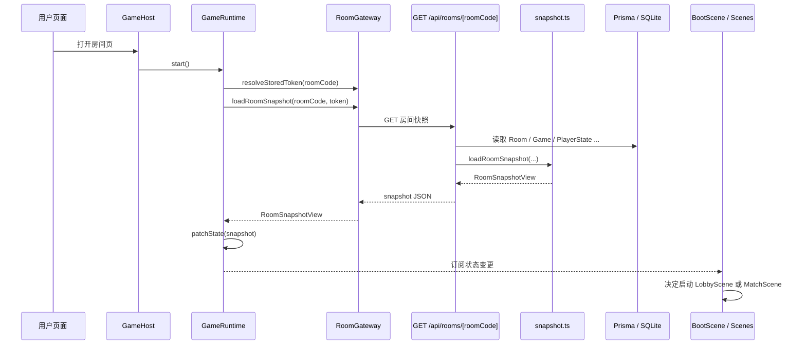
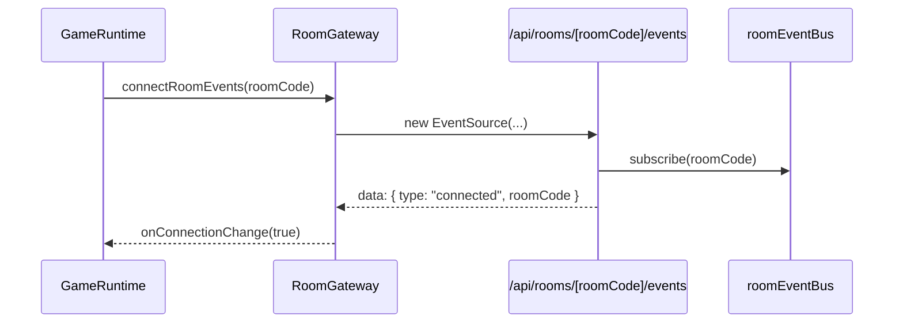
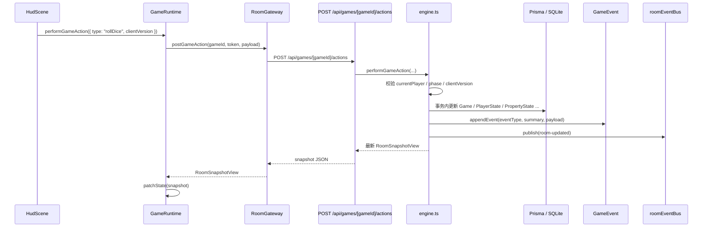
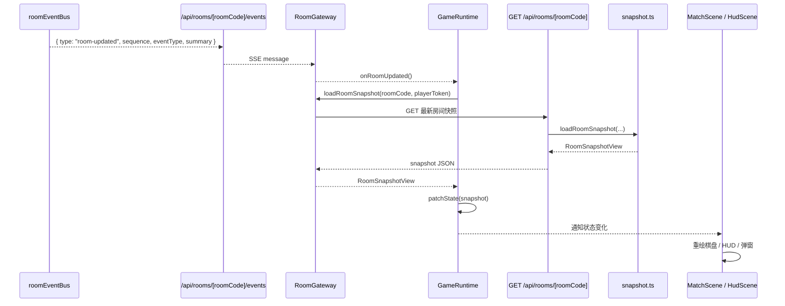
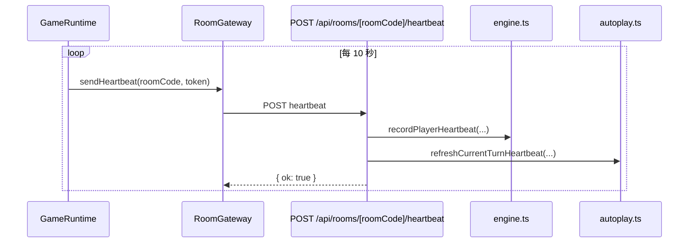
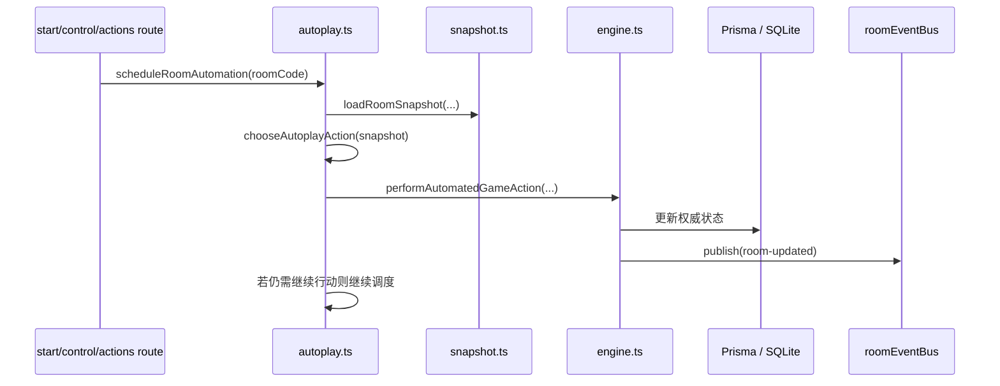
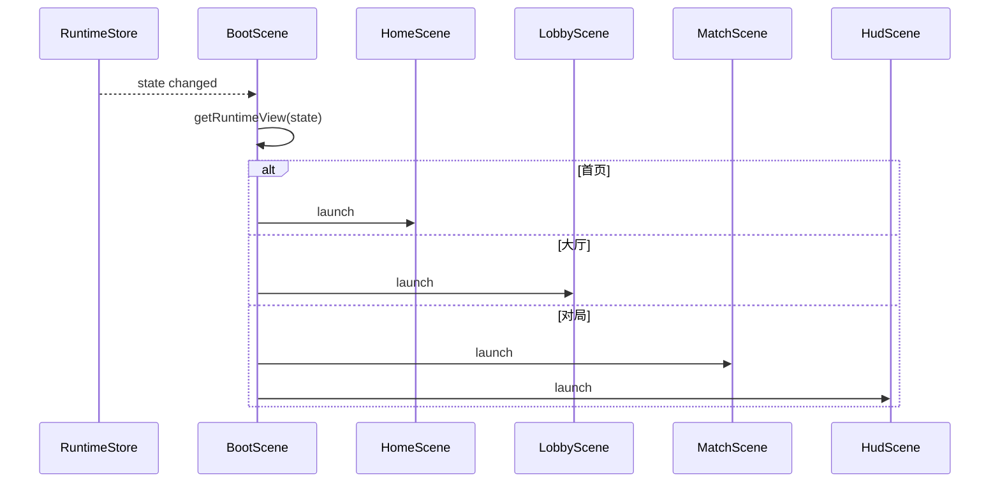

# 联机与 SSE 时序文档

本文档描述当前项目的联机同步方式，以及客户端、API、引擎、数据库和 SSE 之间的时序关系。

## 1. 核心原则

当前项目的实时同步不是“服务端把完整游戏状态实时推给所有客户端”，而是：

1. 客户端通过 HTTP 请求提交动作
2. 服务端在事务里更新权威状态
3. 服务端发布一个轻量 `room-updated` 事件
4. 各客户端收到 SSE 事件后重新拉取完整房间快照

也就是说：

- **SSE 负责通知**
- **快照负责同步状态**

## 2. 关键参与者

- 浏览器页面
- `GameRuntime`
- `RoomGateway`
- Next.js API Route
- `engine.ts`
- Prisma / SQLite
- `roomEventBus`
- Phaser Scenes

## 3. 初次进入房间

## 4. 建立 SSE 连接

说明：

- 客户端当前只把 `connected` 当作连接状态信号。
- 实际业务刷新依赖后续的 `room-updated`。

## 5. 玩家提交局内动作

以掷骰为例：

这个流程有两个结果同时发生：

1. 当前请求发起方立刻拿到新的完整快照
2. 其他订阅该房间的客户端会收到 SSE 更新通知

## 6. 其他客户端收到房间更新

## 7. 为什么不直接通过 SSE 推完整快照

当前设计的好处：

- SSE 消息体小
- 服务端只维护一份快照生成逻辑
- 不需要同时维护“HTTP DTO”和“SSE DTO”两套状态结构
- 前端只消费同一种 `RoomSnapshotView`

代价：

- 每次更新都要重新拉一次快照
- 房间更新较频繁时，HTTP 请求会变多

对于当前项目体量，这个取舍是合理的。

## 8. 心跳与托管时序

说明：

- 心跳不直接返回快照。
- 它主要用于维持在线状态和托管超时逻辑。

## 9. 托管 / 机器人自动行动时序

关键点：

- 机器人和托管不是前端模拟，而是服务端真实调用引擎。
- 因此它们与玩家动作共享同一套规则与事务约束。

## 10. 客户端视图切换时序

这说明：

- 场景切换由 `BootScene` 根据 store 状态统一控制
- 各子场景并不直接决定应用当前在哪个页面阶段

## 11. 当前实时架构的限制

### 11.1 单进程事件总线

`roomEventBus` 是进程内总线。

这意味着：

- 当前更适合单实例部署
- 如果以后改成多实例或分布式部署，需要把它替换为跨实例消息系统

### 11.2 SSE 是单向的

当前通信模型：

- 客户端 -> 服务端：HTTP
- 服务端 -> 客户端：SSE

优点：

- 简单
- 易调试
- 服务端逻辑集中

缺点：

- 不适合非常高频的细粒度实时状态

## 12. 调试建议

如果你在排查“为什么另一端没刷新”，按这个顺序查：

1. 动作 API 有没有成功返回
2. `engine.ts` 有没有 `appendEvent` 和 `publishEvent`
3. `roomEventBus` 有没有订阅者
4. `/api/rooms/[roomCode]/events` 是否还保持连接
5. 客户端是否收到了 `room-updated`
6. `GameRuntime.refreshRoom()` 是否触发
7. `GET /api/rooms/[roomCode]` 返回的 snapshot 是否真的变了

## 13. 关键文件索引

- 客户端运行时：`src/game-client/phaser/GameRuntime.ts`
- 网关封装：`src/game-client/net/roomGateway.ts`
- 场景切换：`src/game-client/scenes/BootScene.ts`
- 服务端动作入口：`src/app/api/games/[gameId]/actions/route.ts`
- 房间 SSE：`src/app/api/rooms/[roomCode]/events/route.ts`
- 游戏引擎：`src/lib/game/engine.ts`
- 快照生成：`src/lib/game/snapshot.ts`
- 事件总线：`src/lib/game/event-bus.ts`
